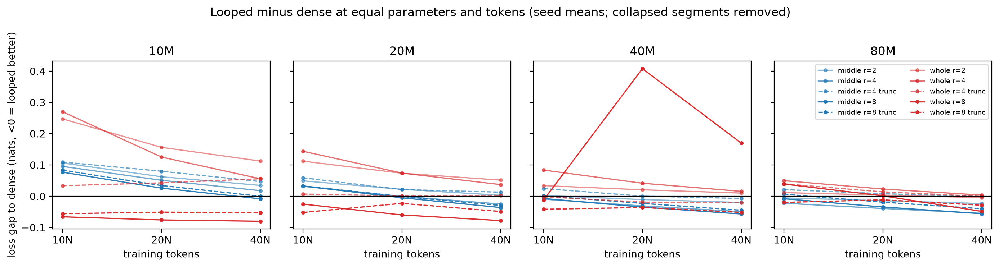
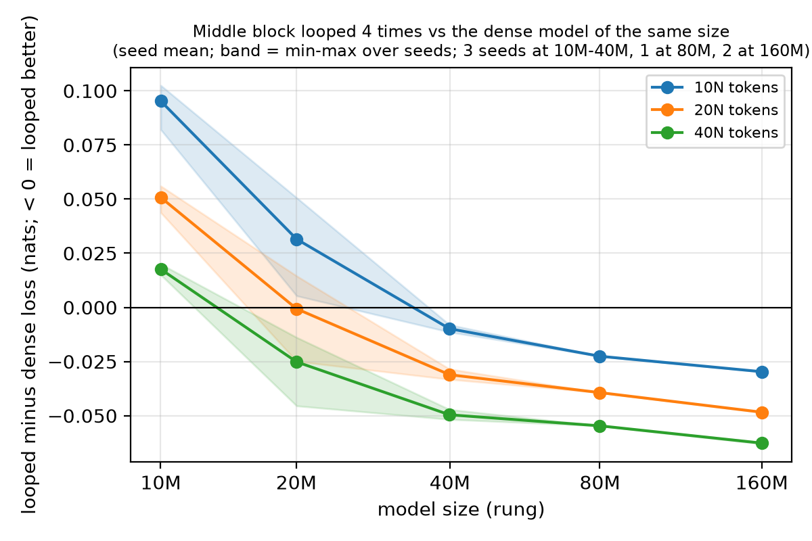
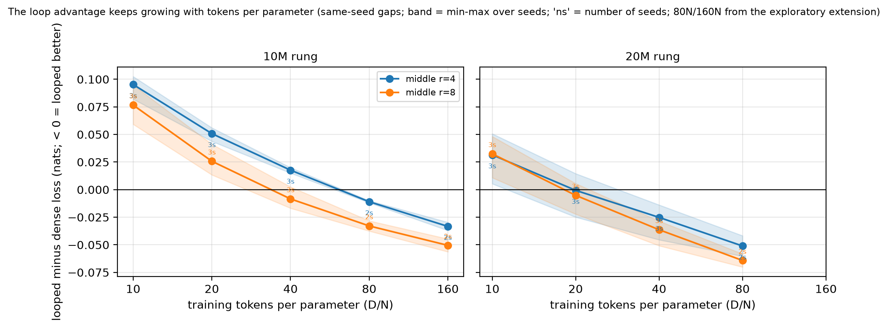
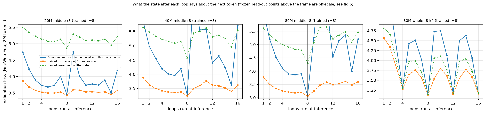
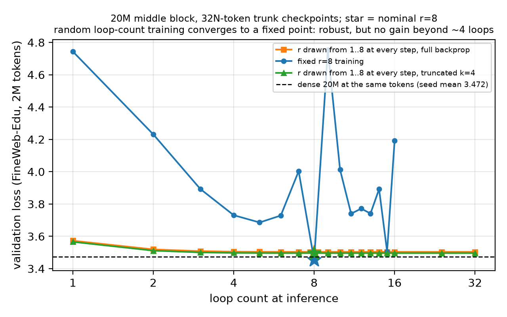

# How much is a loop worth?

**A pre-registered scaling study of looped (recurrent-depth) transformers from 10M to 160M parameters**

> **Status (2026-10-11).** The pre-registered main grid (111 training runs) is complete and analysed, and so are the
> 160M looped runs of the extension. The synthetic reasoning suite is running. A paper is in preparation.
> All results below are preliminary. Anything marked *exploratory* was not part of the pre-registration.

A looped transformer runs a block of layers *r* times. This costs *r* times the compute of that block but adds no
parameters. We ask how many parameters one extra loop is worth, and when.

We model the effective size of a looped model as

    N_eff = N_once + r^φ · N_rec

where N_once counts the parameters that run once, N_rec the looped parameters, and N_eff is the size of the dense
model with the same loss. A dense "ruler" fitted on dense models of the same family converts losses into N_eff.
φ = 0 means extra loops are worth nothing; φ = 1 means *r* loops are as good as *r* distinct copies of the block.
We also test how φ depends on where the loop sits, on truncated backpropagation through the loops, whether it
saturates in *r*, and which *r* is compute-optimal.

## Design (pre-registered)

| | |
|---|---|
| Model sizes ("rungs") | 10M, 20M, 40M, 80M looped cells (width 320 / 448 / 640 / 896, 8 unique layers); the dense ruler adds 160M (width 1280). N (non-embedding + output head of the dense model) = 15.4M / 26.8M / 50.2M / 92.7M / 179.6M |
| Cells | dense (r = 1); **middle block** (2 prelude + 4 looped + 2 coda layers) and **whole stack**, r ∈ {2, 4, 8}; truncated backprop through the last k = r/2 loops at r = 4 and 8 |
| Budgets | WSD schedule with cooldown branches at 10N, 20N, 40N tokens (dense ruler: 5N–80N, 160M up to 40N); iso-token and iso-FLOP accounting |
| Seeds | 3 seeds at 10M–40M, 1 at 80M and for the 160M ruler |
| Data | FineWeb-Edu sample-10BT (10.4B tokens, single epoch, fixed order), 16k BPE. Validation: held-out FineWeb-Edu (main), SlimPajama, FineMath, code |
| Fits | Huber loss in log space, L-BFGS-B with 500 starts, 1000 block-bootstrap resamples; two-stage (ruler first) as primary analysis, joint fit as secondary; leave-one-rung-out extrapolation |

The pre-registration was frozen on 2026-09-23, before any training run, and its SHA-256 is recorded in the repository
history ([how to verify](docs/preregistration.md)). Every later change to the plan is dated in the
[deviation log](docs/deviation-log.md).

## Results so far

### Pre-registered verdicts (111 runs, 474 end-of-cooldown losses)

| Hypothesis | Verdict |
|---|---|
| **H1** Truncated backprop lowers φ (under both iso-token and iso-FLOP accounting) | **Not supported.** Middle block: 0.00 vs 0.13 (predicted direction, overlapping intervals); whole stack: 0.17 vs 0.00 (opposite direction). |
| **H2** Looping a middle block gives a higher φ than looping the whole stack | **Depends on the view.** φ is mixed; raw losses at matched executed depth favour the middle block in all 24 comparisons. |
| **H3** φ saturates in r (a geometric-saturation form beats r^φ) | **Not supported, opposite direction.** r^φ extrapolates better in both leave-one-rung-out directions; AIC lower by 16. |
| **H4** The compute-optimal r is ≤ 2 under matched training FLOPs and larger under matched deployment FLOPs | **First half holds trivially** (the dense model, r = 1, is optimal), **second half not supported.** |

### How much is a loop worth?

The per-cell φ (two-stage fit, main validation set) is 0.13 [0.02, 0.27] for the middle block with full backprop,
0.00 [0.00, 0.17] truncated, 0.00 [0.00, 0.16] for the whole stack with full backprop and 0.17 [0.10, 0.20] truncated.
The ruler is weakly identified (its irreducible loss sits at the lower bound and α = 0.054); a joint fit gives
α = 0.267 and φ of 0.29–0.41 for three of the four cells (0.00 for the whole stack with full backprop). Because the absolute φ depends on the ruler, we lead with quantities that need
no fitted ruler:

- **Equal parameters and tokens** (Figure 1). At 10M most looped cells are worse than the dense model (whole-stack
  r = 8 is the exception), at 20M they are roughly even and at 40M–80M most are better; the advantage grows with the
  token budget (80M middle block, r = 4: −0.023, −0.039,
  −0.055 nats at 10N, 20N, 40N).
- **More tokens per parameter** (*exploratory*, Figure 11). Extending 10M and 20M runs to 80N and 160N, each
  doubling of D/N adds another 0.02–0.03 nats of advantage, with no sign of saturation. A 10M middle-block r = 8
  model at 160N matches a dense model trained on 1.68× as many tokens (two-seed mean; about 0.85× at 10N).
- **Equal training compute** (*exploratory*). Converting each looped run's training FLOPs into dense-model tokens,
  the dense model wins all 320 comparisons. The gap shrinks with the budget but never closes in the range tested.
  Loops buy parameter and data efficiency, not compute efficiency.
- **Model size** (Figure 12). The same cell, a middle block looped 4 times, goes from 0.10 nats worse than the dense
  model at 10M to 0.03 nats better at 160M (10N tokens), and at every budget the gap improves monotonically with size:
  at 40N it is +0.018, −0.025, −0.050, −0.055 and −0.063 nats from 10M to 160M. The two 160M seeds agree within 0.001
  nats. Per-rung fits (*exploratory*) give φ rising with size for the middle block (r = 4 only: −0.32, 0.19, 0.39, 0.52,
  0.65 from 10M to 160M) and falling for the truncated whole stack (0.23, 0.18, 0.15, 0.09 from 10M to 80M).

<p align="center">
  <br>
  
  
</p>

### What does the looped block compute? (*exploratory*)

Probing the trained language models loop by loop (Figures 6, 8–10):

- **Fixed loop count (r = 8).** With a trained linear adapter, the state after loop 4 already reads out within
  0.1–0.2 nats of the final loss. The last loop is a large non-linear write-out step. Running fewer or more loops at
  inference breaks the model.
- **Whole-stack loops with truncated backprop (k = 4)** learn a period-4 cycle. The state returns to almost the same point every 4 loops,
  so the model tolerates loop counts that are multiples of 4 but gains nothing from extra loops.
- **Random loop count during training** (r drawn from 1–8 at every step, as in Huginn; 20M) learns a contraction
  to a fixed point. The model is fully robust to the inference loop count (1–32) but gains nothing beyond about 4 loops,
  and at r = 8 it is 0.05 nats worse than fixed-r training, tying the dense model.
- **Learning rate.** Lower learning rates push fixed-r middle-block models towards convergent iteration (flatter
  loop-count curves; 20M, one seed). On web text, more loops than trained never help.

<p align="center">
  <br>
  
</p>

### Do loops learn to reason step by step? Synthetic tasks (*pilot, one seed; formal runs in progress*)

Chains of lookups through 32 fixed random tables (trained on 1–8 steps, tested up to 24), answered in a single
forward pass:

- At equal parameters, an 8-layer model looped 8 times solves longer chains than the 8-layer dense model
  (5 vs 4 steps at ≥ 90% accuracy). A 36-layer dense model of the same depth, with 4.4× the parameters, solves 7.
- The looped model trained at learning rate 5e-4 learned a **one-step-per-loop algorithm**, visible directly in
  intermediate-value probes, and **solves longer chains when given more loops at inference**: 65% on 10-step chains
  with 16 loops, against 5% for the 36-layer dense model. The same architecture at learning rate 1e-3 learned a
  fixed-length program instead.

These are calibration results from a single seed. The formal suite (two new seeds, learning rates chosen on
in-distribution accuracy only, rules [written before the sweep](docs/deviation-log.md)) is running.

## Documents

| | |
|---|---|
| [docs/preregistration.md](docs/preregistration.md) | Pre-registration v1.0: questions, hypotheses, design, analysis plan (English translation of the frozen original) |
| [docs/deviation-log.md](docs/deviation-log.md) | Every change to the plan, dated and append-only; frozen hyper-parameters, data and throughput (appendix C) |
| [docs/results.md](docs/results.md) | Full results: pre-registered fits and verdicts, robustness, and all exploratory analyses |
| [docs/synthetic-reasoning-design.md](docs/synthetic-reasoning-design.md) | Design v2 of the synthetic reasoning tasks (frozen 2026-10-09) |
| [docs/roadmap.md](docs/roadmap.md) | Project phases and status |

## Repository layout

```
docs/                project documents (above)
code/
  looped/            model (prelude / looped core / coda, input injection, truncated backprop), FLOP counting,
                     data stream, WSD schedule, training loop with cooldown branches, evaluation
  scripts/           data preparation, config generation, run queue, throughput measurement, result export,
                     loss-spike statistics
  fit/               scaling-law fits, H4 calculation, per-rung φ, per-token analysis, per-loop probes, figures
  synthetic/         synthetic reasoning tasks, trainer, multi-GPU suite runner, intermediate-value probes
  configs/           every run config and manifest (sweeps, main grid, extensions)
  results/           per-run results, collected tables, fits, probe outputs, figures
  tests/             unit and smoke tests
```

## Reproducing

```
cd code
uv venv --python 3.11 && source .venv/bin/activate && uv pip install -e .
python -m pytest tests -q
```

Training ran on 4× RTX 4090 with PyTorch 2.6 (CUDA 12.4), one run per GPU; the main grid took 11 days on the four GPUs.
Fits and figures run on a laptop CPU. The full command sequence (data preparation, learning-rate sweep, main grid,
fits, figures, extensions) is in [code/README.md](code/README.md). Per-run results and training logs are in
`code/results/`, so every number above can be recomputed without retraining.

## Citation and license

A paper is in preparation; citation details will be added here. The code is released under the MIT license
(see [LICENSE](LICENSE)).
